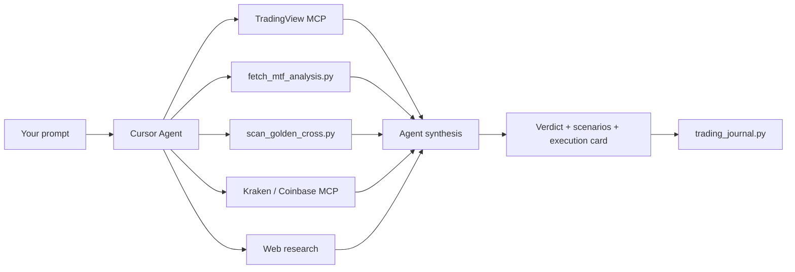

# Stock Screener AI

An AI-powered stock and crypto analysis workspace for [Cursor](https://cursor.com). Chat with the agent in natural language — it runs multi-timeframe technicals, screens hundreds of tickers, compares picks against market baselines, and builds probability-weighted trade plans with entries, stops, and targets.

Built as a **Cursor Agent Skill** plus Python analysis scripts. No paid data API is required for core features (Yahoo Finance + optional TradingView MCP).

---

## What it can do for you

| Capability | What you get |
|------------|--------------|
| **Single-ticker analysis** | Long, short, or wait verdict with MTF matrix, Wyckoff phase, chart patterns, bull/bear merge, and an execution card |
| **S&P 500 scans** | Rank ~500 names by 1- or 3-month **peak-in-span** upside, then deep-dive the top candidates with full MTF |
| **NASDAQ golden-cross scan** | Find under-the-radar names with fresh weekly/daily golden crosses and bullish confluence |
| **Crypto analysis** | BTC, ETH, and alts with cycle context (rainbow bands), Kraken/Coinbase live quotes, and BTC as a market driver |
| **Market baselines** | Every stock or crypto call is framed vs **SPX**, **QQQ**, **NQ1!** (Nasdaq futures), and **BTC** so you know if a pick beats the tide |
| **Learning journal** | Analyses are logged; outcomes are tracked over time and probabilities are calibrated from real results |

**Horizon default:** tactical swings (weeks to a few months). For targets ≤3 months, the agent reports **peak prices touched during the window** — not just where price might close on the last day.

---

## How it works

This is not a black-box screener that dumps a ticker list. The agent follows a structured workflow and **reconciles multiple data sources** before giving a verdict.



### 1. Agent Skill (the brain)

The skill at `.cursor/skills/stock-trading-analysis/` teaches the Cursor agent how to analyze trades. It enforces:

- **Higher timeframe leads** — monthly/weekly set bias; daily and below are for entry timing only
- **Independent verdict** — TradingView BUY/SELL is one input, not the final answer
- **Conflict detection** — flags when lower timeframes look bullish but higher timeframes show distribution or exhaustion
- **Risk first** — every plan includes entry, stop, targets, and position sizing (1% account risk default)
- **Peak-in-span targets** — for 1–3 month horizons, estimates the highest (or lowest for shorts) price likely touched in the window

### 2. Multi-timeframe engine (`fetch_mtf_analysis.py`)

Pulls Yahoo Finance OHLC and computes indicators across **8 timeframes**:

| Timeframe | Role |
|-----------|------|
| Monthly | Macro extension, RSI extremes |
| Weekly | Primary bias, Wyckoff, main stops |
| Daily | Entry triggers, golden/death cross |
| 3-month | Recent swing structure |
| 4H / 2H / 1H | Entry timing (never used alone against HTF) |

**Per timeframe:** RSI, SMA 20/50/200, EMA 20, MACD, Bollinger Bands, golden/death cross, volume trend, candlestick patterns, Wyckoff hints, and chart patterns (cup & handle, ascending triangle, rising/falling wedge).

Output includes `conflicts[]`, `synthesis.trade_bias`, and `chart_patterns_summary`.

### 3. Bulk screener (`scan_golden_cross.py`)

Screens the market in two modes:

- **NASDAQ (default)** — fresh golden crosses with confluence scoring; mega-caps filtered out for “under the radar” bias
- **S&P 500** — `--sp500-upside-1mo`, `--sp500-upside`, or `--sp500-weekly` for golden-cross or peak-gain ranking

Phase 1 is a fast filter across hundreds of symbols; phase 2 runs full MTF on the top N hits.

### 4. Live data (MCP servers)

Optional but recommended — configured in `.cursor/mcp.json`:

| Server | Purpose |
|--------|---------|
| **TradingView** | Live quotes, TV-aligned indicators, MTF confluence, macro snapshot |
| **Kraken** | Crypto OHLC and ticker (public endpoints, no API key) |
| **Coinbase** | Crypto MCP (requires CDP API key in `live` env) |

The agent merges MCP data with local scripts. Local scripts stay **required** for custom patterns, Wyckoff synthesis, and monthly bars.

### 5. Learning loop (`trading_journal.py`)

Every completed analysis can be logged to `journal/analyses.jsonl`. Later:

```bash
python ".cursor/skills/stock-trading-analysis/scripts/trading_journal.py" update-outcomes
python ".cursor/skills/stock-trading-analysis/scripts/trading_journal.py" calibrate
```

Calibration adjusts scenario probabilities based on tracked win rates for similar setups (golden cross, distribution fade, etc.).

---

## Example prompts

Copy these into Cursor Agent chat (adjust tickers, horizon, or direction as needed).

### Single stock — long setup

> Analyze **NEE** for a 6-week long. I want MTF matrix, Wyckoff, scenario probabilities, and a full execution card with entry, stop, and peak-in-span targets.

### Single stock — short / fade

> **SNDK** looks parabolic. Give me a tactical short thesis with weekly Wyckoff, RSI extension, bull vs bear sentiment merge, and invalidation above resistance.

### S&P 500 scan — best ideas for next month

> Run an **S&P 500 1-month scan** for the best upside candidates. Compare top picks vs **SPX**, **QQQ**, and **NQ1!** peak potential. Rank by relative upside and give me full MTF on the top 5.

### Find fresh golden crosses

> Scan **NASDAQ** for fresh **weekly golden crosses** in the last month with bullish confluence. Skip mega-caps. Show me the top 10 with reasons.

### Crypto — bottom range and cycle context

> Estimate the **bottom range for ETH** before it's bullish again. Use historical cycle drawdowns, rainbow bands, weekly structure, and compare to **BTC** baseline.

### Crypto — connectivity and spot check

> Pull **BTC** price from **Kraken and Coinbase** MCP and run full MTF. Is the agent bias long, short, or wait vs BTC driving the market?

### Market context before picking stocks

> What are **SPX**, **QQQ**, **NQ1!**, and **BTC** doing for the next month? Peak-in-span estimates only. Should I be aggressive or defensive on new longs?

### Trade plan from a chart screenshot

> Here's a weekly chart of **FSLR**. Reconcile my levels with live data, check for cup & handle or wedge, and tell me if I should stalk a long or wait.

### Journal-aware follow-up

> Update journal outcomes and recalibrate. Then re-analyze **TXT** with calibrated probabilities for a 4-week long.

---

## Quick start

### Requirements

- [Cursor IDE](https://cursor.com) (Agent mode)
- Python **3.10+**
- Optional: [`uv`](https://docs.astral.sh/uv/) for MCP servers (`uvx`)

### Install

1. Clone this repo and open it in Cursor.
2. The agent skill lives at `.cursor/skills/stock-trading-analysis/` — Cursor loads it automatically in this workspace.
3. (Optional) Configure MCP in `.cursor/mcp.json` and restart Cursor → **Settings → MCP** until servers show green.

### Run scripts manually

```bash
# Full multi-timeframe analysis on one ticker
python ".cursor/skills/stock-trading-analysis/scripts/fetch_mtf_analysis.py" SOFI --pretty

# S&P 500 — top 1-month peak-gain candidates + MTF on top 12
python ".cursor/skills/stock-trading-analysis/scripts/scan_golden_cross.py" --sp500-upside-1mo --top-mtf 12 --pretty

# NASDAQ golden-cross scan (default)
python ".cursor/skills/stock-trading-analysis/scripts/scan_golden_cross.py" --pretty

# Journal calibration
python ".cursor/skills/stock-trading-analysis/scripts/trading_journal.py" calibrate
```

### Optional environment

Copy `.cursor/skills/stock-trading-analysis/.env.example` to `.env` if you want a Finnhub quote cross-check (`FINNHUB_API_KEY`).

---

## What a typical response includes

1. **Verdict** — long / short / wait + confidence
2. **Multi-timeframe matrix** — all timeframes with bias, RSI, MA stack, patterns
3. **MTF conflicts** — e.g. daily bullish but weekly distribution warning
4. **Scenario probabilities** — direction outcomes and target reach estimates
5. **Fundamental + sentiment** — bull case vs bear case, merged
6. **Execution card** — entry zone, stop, T1/T2/T3 (peak-in-span), position size, invalidation
7. **Market baseline comparison** — how the pick stacks vs SPX/QQQ/BTC when relevant

See [examples.md](.cursor/skills/stock-trading-analysis/examples.md) for a full SNDK short walkthrough.

---

## Project structure

```
.cursor/
  mcp.json                          # TradingView, Kraken, Coinbase MCP config
  skills/stock-trading-analysis/
    SKILL.md                        # Agent workflow (required reading for the AI)
    scripts/
      fetch_mtf_analysis.py         # Multi-timeframe engine
      scan_golden_cross.py          # S&P 500 / NASDAQ screener
      fetch_chart.py                # Single-TF deep dive
      fetch_btc_rainbow.py          # BTC rainbow regression bands
      trading_journal.py            # Log, outcomes, calibration
    journal/                        # Persistent analysis history
    *.md                            # Wyckoff, patterns, MTF rules, market data
```

---

## MCP setup (optional)

**TradingView** — install `uv`, then pre-warm:

```bash
uv tool install tradingview-mcp-server
```

**Kraken** — uses `uvx mcp-kraken`; public market data works without API keys.

**Coinbase** — requires ECDSA API credentials:

```bash
npx -y @coinbase/coinbase-cli env live --key-id YOUR_ID --key-secret YOUR_SECRET --allow-plaintext-secrets
```

Set `CDP_ENV=live` in the Coinbase MCP `env` block. Details: [market-data.md](.cursor/skills/stock-trading-analysis/market-data.md).

---

## Disclaimer

**Not financial advice.** This project is for education and research. All probabilities and targets are estimates based on technical context — not guarantees. You are responsible for your own trading decisions, risk management, and compliance with applicable laws.
