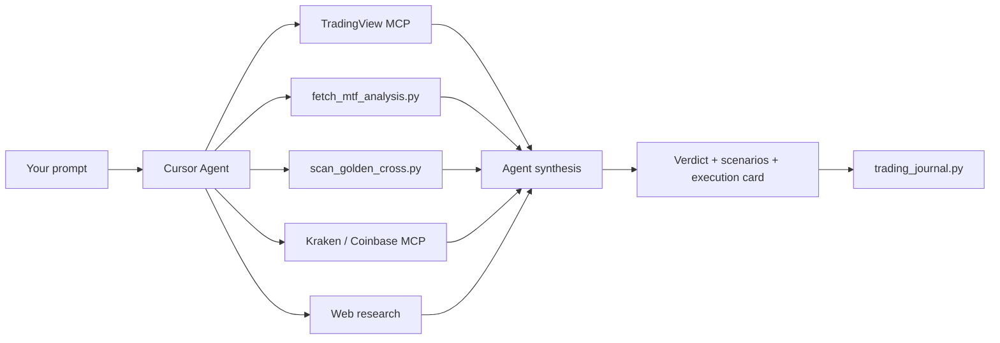

# Stock Screener AI

An AI-powered stock and crypto analysis workspace for [Cursor](https://cursor.com). Chat with the agent in natural language — it runs multi-timeframe technicals, screens hundreds of tickers, compares picks against market baselines, and builds probability-weighted trade plans with entries, stops, and targets.

Built as a **Cursor Agent Skill** plus Python analysis scripts. No paid data API is required for core features (Yahoo Finance + optional TradingView MCP).

---

## What it can do for you

| Capability | What you get |
|------------|--------------|
| **Single-ticker analysis** | Long, short, or wait verdict with MTF matrix, Wyckoff phase, chart patterns, bull/bear merge, and an execution card |
| **S&P 500 scans** | Rank ~500 names by 1- or 3-month **peak-in-span** upside, then deep-dive the top candidates with full MTF |
| **NASDAQ golden-cross scan** | Find under-the-radar names with fresh weekly/daily golden crosses and bullish confluence |
| **Crypto analysis** | BTC, ETH, and alts with cycle context (rainbow bands), Kraken/Coinbase live quotes, and BTC as a market driver |
| **Market baselines** | Every stock or crypto call is framed vs **SPX**, **QQQ**, **NQ1!** (Nasdaq futures), and **BTC** so you know if a pick beats the tide |
| **Learning journal** | Analyses are logged; outcomes are tracked over time and probabilities are calibrated from real results |

**Horizon default:** tactical swings (weeks to a few months). For targets ≤3 months, the agent reports **peak prices touched during the window** — not just where price might close on the last day.

---

## How it works

This is not a black-box screener that dumps a ticker list. The agent follows a structured workflow and **reconciles multiple data sources** before giving a verdict.



### 1. Agent Skill (the brain)

The skill at `.cursor/skills/stock-trading-analysis/` teaches the Cursor agent how to analyze trades. It enforces:

- **Higher timeframe leads** — monthly/weekly set bias; daily and below are for entry timing only
- **Independent verdict** — TradingView BUY/SELL is one input, not the final answer
- **Conflict detection** — flags when lower timeframes look bullish but higher timeframes show distribution or exhaustion
- **Risk first** — every plan includes entry, stop, targets, and position sizing (1% account risk default)
- **Peak-in-span targets** — for 1–3 month horizons, estimates the highest (or lowest for shorts) price likely touched in the window

### 2. Multi-timeframe engine — Phase 2 (`fetch_mtf_analysis.py`)

Phase 2 runs **after** Phase 1 screening (or on any single ticker you name). It pulls Yahoo Finance OHLC across **8 timeframes** and computes the full indicator stack, conflict detection, and synthesis verdict.

| Timeframe | Role |
|-----------|------|
| Monthly | Macro extension, RSI extremes, long-term patterns |
| Weekly | Primary bias, Wyckoff, main stops |
| Daily | Entry triggers, golden/death cross |
| 3-month | Recent swing structure |
| 4H / 2H / 1H | Entry timing (never used alone against HTF) |

#### Phase 2 technical indicators (per timeframe)

| Category | Indicators / outputs |
|----------|----------------------|
| **Moving averages** | SMA 20 / 50 / 200, EMA 20, MA stack (bullish / mixed / bearish), extension % from 200 SMA |
| **Crosses** | Golden cross, death cross, forming variants |
| **Momentum** | RSI (14) + RSI zone, RSI divergence (bullish / bearish) |
| **MACD** | MACD line, signal, histogram, status (bullish / bearish / cross forming) |
| **Volatility** | Bollinger Bands (upper / middle / lower, width %, price position) |
| **Volume** | 20-bar trend, vs-average %, price–volume divergence (Wyckoff effort vs result) |
| **Wyckoff** | Phase hint: accumulation possible, distribution warning, markup, markdown, range |
| **Candlesticks** | Context-aware patterns (hammer, doji, engulfing, etc.) |
| **Chart patterns** | Cup & handle, ascending triangle, rising / falling wedge (state + measured target) |
| **Performance** | 1-month and 3-month % change |
| **Bias** | Per-TF bullish / bearish / neutral score with reasons |

#### Phase 2 synthesis outputs

- `conflicts[]` — HTF/LTF mismatches (e.g. daily golden cross inside weekly death cross, weekly distribution, extension warnings)
- `synthesis.verdict` — e.g. `bullish_aligned`, `bullish_but_conflicted`, `mixed_neutral`, `bearish_aligned`
- `synthesis.trade_bias` — agent-facing: `long`, `wait`, `wait_or_reduce_size`, `short_or_avoid`
- `chart_patterns_summary` — primary pattern, setup tags, pivot / measured target

```bash
python ".cursor/skills/stock-trading-analysis/scripts/fetch_mtf_analysis.py" FSLR --pretty
```

---

### 3. Bulk screener — Phase 1 + Phase 2 (`scan_golden_cross.py`)

The screener is a **two-phase pipeline**:

```text
Phase 1  →  Fast filter across thousands of symbols (Yahoo weekly + daily only)
Phase 2  →  Full MTF on top N hits (`--top-mtf`, default 12)
```

Every Phase 1 hit carries a **`phase1_trend_label`**: **Established Trend** or **Emerging Trend**.

#### Phase 1 trend labels

| Label | Meaning |
|-------|---------|
| **Established Trend** | Fresh golden cross and/or bullish structure already in place |
| **Emerging Trend** | Pre–golden-cross: 50 SMA approaching 200 SMA from below on daily and/or weekly |

#### Phase 1 technical indicators (lightweight)

Phase 1 uses `fetch_chart.py` → Yahoo OHLC. It does **not** run full MTF — only what is needed to filter fast:

| Indicator | Used for |
|-----------|----------|
| **SMA 50 / 200** | Golden/death cross detection, Emerging Trend gap (2%–5%) |
| **SMA 20** | Daily stack context (via `fetch_yahoo` technicals) |
| **EMA 20** | Available on daily fetch |
| **RSI (14)** | Overbought / extension filters |
| **MA stack** | Bullish / mixed / bearish classification |
| **Extension from 200 SMA %** | “Already extended” rejection |
| **Golden / death cross status** | Fresh cross age (weekly / daily lookback windows) |
| **52-week high / low** | Distance from ATH, upside-to-high (S&P modes) |
| **1M / 3M % change** | Parabolic / chase filters |
| **20-day avg volume** | Liquidity context on daily bars |

#### Phase 1 filters by scan mode

**Established Trend — NASDAQ default (`quick_screen`)**

| Filter | Rule |
|--------|------|
| Golden cross | Fresh **weekly** GC (≤12 weeks) **or** fresh **daily** GC (≤30 days) |
| Weekly extension | ≤ 22% above 200 SMA |
| Weekly RSI | ≤ 68 |
| Daily RSI | ≤ 72 |
| 3-month weekly gain | ≤ 45% |
| vs 52-week high | Must be ≥ 3% below ATH |
| Weekly MA stack | Not bearish |
| Conflict | Rejects daily GC inside confirmed weekly death cross |
| Universe | Mega-caps excluded (AAPL, NVDA, META, …) |

**Established Trend — S&P 500 upside (`--sp500-upside`, `--sp500-upside-1mo`)**

| Filter | Rule |
|--------|------|
| Weekly MA stack | `bullish`, `mixed_bullish`, or `mixed` |
| Weekly death cross | Rejected (unless “forming”) |
| Weekly extension | ≤ 35% above 200 SMA |
| Weekly RSI | ≤ 72 |
| Upside to 52-week high | ≥ 8% |
| GC flags | Weekly (≤16w) and daily (≤30d) tracked for ranking |

**Established Trend — S&P 500 weekly GC (`--sp500-weekly`)**

| Filter | Rule |
|--------|------|
| Golden cross | Fresh weekly GC within `--weeks` lookback (default 5) |

**Emerging Trend (`--emerging-trend`, `--sp500-emerging-trend`, `--crypto-emerging-trend`)**

All rules must pass **per qualifying timeframe** (daily and/or weekly):

| Filter | Rule |
|--------|------|
| 50 vs 200 SMA | 50 **below** 200, gap **2%–5%** |
| 50 SMA slope | Rising over **≥10** bars (days on daily, weeks on weekly) |
| 200 SMA slope | **Flat or rising** (declining 200 rejected) |
| Price | **Above** both 50 and 200 SMA |

#### Phase 1 CLI examples

```bash
# NASDAQ Established (default) + Phase 2 MTF on top 12
python ".cursor/skills/stock-trading-analysis/scripts/scan_golden_cross.py" --top-mtf 12 --pretty

# NASDAQ Established + Emerging combined
python ".cursor/skills/stock-trading-analysis/scripts/scan_golden_cross.py" --phase1-combined --top-mtf 12 --pretty

# S&P 500 — 1-month peak-gain ranking
python ".cursor/skills/stock-trading-analysis/scripts/scan_golden_cross.py" --sp500-upside-1mo --top-mtf 30 --pretty

# S&P 500 / NASDAQ / crypto Emerging Trend
python ".cursor/skills/stock-trading-analysis/scripts/scan_golden_cross.py" --sp500-emerging-trend --top-mtf 20 --pretty
python ".cursor/skills/stock-trading-analysis/scripts/scan_golden_cross.py" --emerging-trend --symbols "AAPL,BTC-USD" --pretty
python ".cursor/skills/stock-trading-analysis/scripts/scan_golden_cross.py" --crypto-emerging-trend --pretty
```

#### Phase 2 ranking (after Phase 1 hits)

| Scan type | Phase 2 score | What it ranks |
|-----------|---------------|---------------|
| NASDAQ / combined Established | `bull_score` | GC freshness, MA stack, Wyckoff, MTF verdict, pattern tags, conflicts |
| S&P upside (1mo / 3mo) | `upside_score` / `upside_score_1mo` | Bull score + upside to 52w high + pattern breakout + peak target probability |
| Emerging Trend | `bull_score` | Emerging TF bonus + full MTF synthesis |

Phase 2 always calls `fetch_mtf_analysis.py` (full indicator list above) on each finalist.

---

### 4. Fundamental and sentiment research

Technicals come from **scripts and MCP**. Fundamentals are gathered by the **Cursor agent** during analysis (Step 7 of the skill workflow) — not from a single bundled API.

| Source | What it provides | How to use |
|--------|------------------|------------|
| **Web search** | Earnings dates, guidance, M&A, sector news, analyst narrative | Agent runs automatically when you ask for analysis or scans; merges bull vs bear case |
| **TradingView MCP** (`combined_analysis`) | Reddit sentiment snippets, news headlines, TV `stock_score` | Optional; one input only — agent may override TV with Wyckoff / MTF conflicts |
| **TradingView MCP** (`yahoo_price`) | Live quote, 52-week range, market state | Quote cross-check vs Yahoo script |
| **Company IR / SEC** | Press releases, 10-Q/10-K (via search links) | Earnings catalysts, backlog, guidance |
| **Finnhub** (optional) | Real-time quote overlay | Set `FINNHUB_API_KEY` in `.env` — cross-check price in `fetch_chart.py`; not full fundamentals |
| **Alpha Vantage** (optional) | Reserved in `.env.example` | Future extension; chart OHLC uses Yahoo today |

**Agent merge rule:** Separate **price action** from **business thesis**. Example: strong earnings story + weekly distribution = tactical wait, not blind long. Catalysts (earnings, FDA, policy) are cited in the execution card and logged in `trading_journal.py` via `setup_tags` like `earnings_catalyst`.

**Crypto fundamentals:** On-chain / cycle context via `fetch_btc_rainbow.py`, Kraken/Coinbase MCP spot data, and web search for regulation / ETF flows — no traditional P/E.

---

### 5. Live data (MCP servers)

Optional but recommended — configured in `.cursor/mcp.json`:

| Server | Purpose |
|--------|---------|
| **TradingView** | Live quotes, TV-aligned indicators, MTF confluence, macro snapshot |
| **Kraken** | Crypto OHLC and ticker (public endpoints, no API key) |
| **Coinbase** | Crypto MCP (requires CDP API key in `live` env) |

The agent merges MCP data with local scripts. Local scripts stay **required** for custom patterns, Wyckoff synthesis, and monthly bars.

### 6. Learning loop (`trading_journal.py`)

Every completed analysis can be logged to `journal/analyses.jsonl`. Later:

```bash
python ".cursor/skills/stock-trading-analysis/scripts/trading_journal.py" update-outcomes
python ".cursor/skills/stock-trading-analysis/scripts/trading_journal.py" calibrate
```

Calibration adjusts scenario probabilities based on tracked win rates for similar setups (golden cross, distribution fade, etc.).

---

## Example prompts

Copy these into Cursor Agent chat (adjust tickers, horizon, or direction as needed).

### Single stock — long setup

> Analyze **NEE** for a 6-week long. I want MTF matrix, Wyckoff, scenario probabilities, and a full execution card with entry, stop, and peak-in-span targets.

### Single stock — short / fade

> **SNDK** looks parabolic. Give me a tactical short thesis with weekly Wyckoff, RSI extension, bull vs bear sentiment merge, and invalidation above resistance.

### S&P 500 scan — best ideas for next month

> Run an **S&P 500 1-month scan** for the best upside candidates. Compare top picks vs **SPX**, **QQQ**, and **NQ1!** peak potential. Rank by relative upside and give me full MTF on the top 5.

### Find fresh golden crosses

> Scan **NASDAQ** for fresh **weekly golden crosses** in the last month with bullish confluence. Skip mega-caps. Show me the top 10 with reasons.

### Crypto — bottom range and cycle context

> Estimate the **bottom range for ETH** before it's bullish again. Use historical cycle drawdowns, rainbow bands, weekly structure, and compare to **BTC** baseline.

### Crypto — connectivity and spot check

> Pull **BTC** price from **Kraken and Coinbase** MCP and run full MTF. Is the agent bias long, short, or wait vs BTC driving the market?

### Market context before picking stocks

> What are **SPX**, **QQQ**, **NQ1!**, and **BTC** doing for the next month? Peak-in-span estimates only. Should I be aggressive or defensive on new longs?

### Trade plan from a chart screenshot

> Here's a weekly chart of **FSLR**. Reconcile my levels with live data, check for cup & handle or wedge, and tell me if I should stalk a long or wait.

### Journal-aware follow-up

> Update journal outcomes and recalibrate. Then re-analyze **TXT** with calibrated probabilities for a 4-week long.

---

## Quick start

### Requirements

- [Cursor IDE](https://cursor.com) (Agent mode)
- Python **3.10+**
- Optional: [`uv`](https://docs.astral.sh/uv/) for MCP servers (`uvx`)

### Install

1. Clone this repo and open it in Cursor.
2. The agent skill lives at `.cursor/skills/stock-trading-analysis/` — Cursor loads it automatically in this workspace.
3. (Optional) Configure MCP in `.cursor/mcp.json` and restart Cursor → **Settings → MCP** until servers show green.

### Run scripts manually

```bash
# Full multi-timeframe analysis on one ticker
python ".cursor/skills/stock-trading-analysis/scripts/fetch_mtf_analysis.py" SOFI --pretty

# S&P 500 — top 1-month peak-gain candidates + MTF on top 12
python ".cursor/skills/stock-trading-analysis/scripts/scan_golden_cross.py" --sp500-upside-1mo --top-mtf 12 --pretty

# NASDAQ Established + Emerging combined
python ".cursor/skills/stock-trading-analysis/scripts/scan_golden_cross.py" --phase1-combined --top-mtf 12 --pretty

# S&P 500 Emerging Trend
python ".cursor/skills/stock-trading-analysis/scripts/scan_golden_cross.py" --sp500-emerging-trend --top-mtf 20 --pretty

# Journal calibration
python ".cursor/skills/stock-trading-analysis/scripts/trading_journal.py" calibrate
```

### Optional environment

Copy `.cursor/skills/stock-trading-analysis/.env.example` to `.env` if you want a Finnhub quote cross-check (`FINNHUB_API_KEY`).

---

## What a typical response includes

1. **Verdict** — long / short / wait + confidence
2. **Multi-timeframe matrix** — all timeframes with bias, RSI, MA stack, patterns
3. **MTF conflicts** — e.g. daily bullish but weekly distribution warning
4. **Scenario probabilities** — direction outcomes and target reach estimates
5. **Fundamental + sentiment** — bull case vs bear case, merged
6. **Execution card** — entry zone, stop, T1/T2/T3 (peak-in-span), position size, invalidation
7. **Market baseline comparison** — how the pick stacks vs SPX/QQQ/BTC when relevant

See [examples.md](.cursor/skills/stock-trading-analysis/examples.md) for a full SNDK short walkthrough.

---

## Project structure

```
.cursor/
  mcp.json                          # TradingView, Kraken, Coinbase MCP config
  skills/stock-trading-analysis/
    SKILL.md                        # Agent workflow (required reading for the AI)
    scripts/
      fetch_mtf_analysis.py         # Multi-timeframe engine
      scan_golden_cross.py          # S&P 500 / NASDAQ screener
      fetch_chart.py                # Single-TF deep dive
      fetch_btc_rainbow.py          # BTC rainbow regression bands
      trading_journal.py            # Log, outcomes, calibration
    journal/                        # Persistent analysis history
    *.md                            # Wyckoff, patterns, MTF rules, market data
```

---

## MCP setup (optional)

**TradingView** — install `uv`, then pre-warm:

```bash
uv tool install tradingview-mcp-server
```

**Kraken** — uses `uvx mcp-kraken`; public market data works without API keys.

**Coinbase** — requires ECDSA API credentials:

```bash
npx -y @coinbase/coinbase-cli env live --key-id YOUR_ID --key-secret YOUR_SECRET --allow-plaintext-secrets
```

Set `CDP_ENV=live` in the Coinbase MCP `env` block. Details: [market-data.md](.cursor/skills/stock-trading-analysis/market-data.md).

---

## Disclaimer

**Not financial advice.** This project is for education and research. All probabilities and targets are estimates based on technical context — not guarantees. You are responsible for your own trading decisions, risk management, and compliance with applicable laws.
